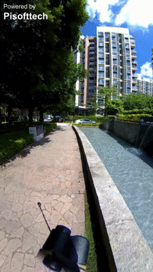
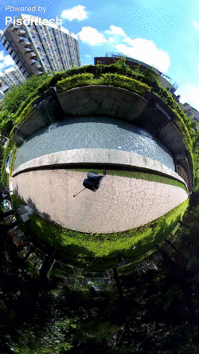
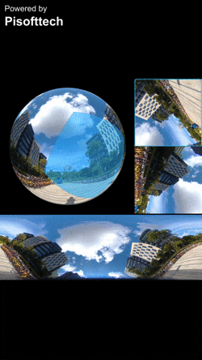
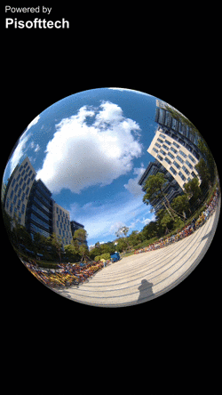

# PiPanoSDK-iOS
## 简介


PiPanoSDK 是一套用于处理全景图像的开发工具包，包含以下功能：

1. 支持 浏览图片、播放视频、预览视频流。
2. 支持图像输入源包含：单鱼眼，双鱼眼，全景2:1等；
3. 支持多种展开模式：沉浸、鱼眼、小行星、圆柱、VR、双画卷等；
4. 支持多种滤镜效果：锐化、木炭笔、轮廓、蓝莓、像素化等；
5. 支持多种过场动画：翻转、渐变、开门、光圈、折叠等；

 

 


## 集成到Xcode工程

[集成PiPanoSDK到Xcode](https://github.com/pisofttech/pipano-sdk-ios/blob/master/integrate-into-xcode-cn.md)


## 演示Demo

扫描二维码


下载链接 ：[App Store](http://itunes.apple.com/app/id1290710793)


## 调用示例

### 1.导入头文件

PiPanoSDK的核心功能都在一个接口里：`PiPano`，它提供了一些静态方法给开发者调用。

要调用 PiPanoSDK里的功能，只需import PiPano的 framework 头文件。如下：

```objective-c
#import <PiPanoSDK/PiPanoSDK.h>
```


### 2.获得镜头视图

调用`getCameraView`来获取镜头View。PiPano将在这个View里展示全景画面，View也会自带一些输入操作。

```objective-c
UIView* piCameraView = [PiPano getCameraView];

//把cameraView装入一个父view里
[superPICameraView setBounds:[[UIScreen mainScreen] bounds]];
[superPICameraView addSubview:piCameraView];
```


### 3.获得初始化完成事件

PiPano初始化需要点时间，完成后会有一个block回调。示例代码：

```objective-c
[PiPano onPiPanoSDKReady:^()
{
   NSLog(@"SDK is ok !");
}];
```


### 4.播放本地图片

PiPano可以播放设备本地的全景图像和视频。

播放图像调用`openPhoto`，示例代码：

```objective-c
- (void)openPhoto:(id)sender
{
    NSString* photoPath = [[NSBundle mainBundle] pathForResource:@"testRes/one_eye_image" ofType:@"jpg"];
    [PiPano openPhoto:photoPath sourceMode: PISM_OneEye];
}
```

